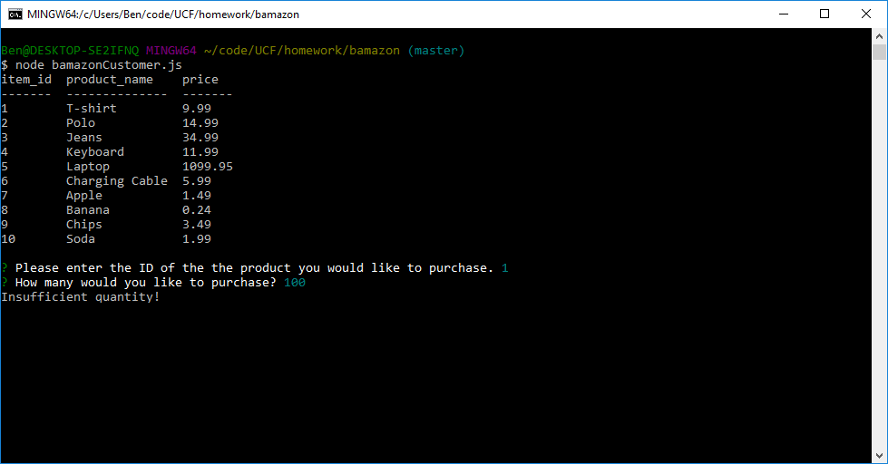

# Bamazon
### These are CLI apps for a fictional store Bamazon
### Bamazon has three clients
* Bamazon Customer

    - With Bamazon Customer you can purchase an item by typing in the id of the product and the quantity you would like to purchase.

        

    - If bamazon has enough of an item in stock your purchase will go through, like shown above.

        

    - If not your purchase will not be processed.

* Bamazon Manager

    - With Bamazon Manager you have a few more options.

        

    - As a manager you can see all products for sale including id, name, price, and quantity.

        

    - You can also see all products that are running low on in your inventory.

        

    - If you are running low on a particular item you can easily add inventory for an item.

        

    - As a manager you can also add a new product.

        

* Bamazon Supervisor

    - With Bamazon Supervisor you also have a couple of options

        

    - As a supervisor you can view sales by Department.
    
        

    - You can also create new Departments for your store.

        

### Ben Houston designed and created these 'Bamazon' CLIs for his coding bootcamp.